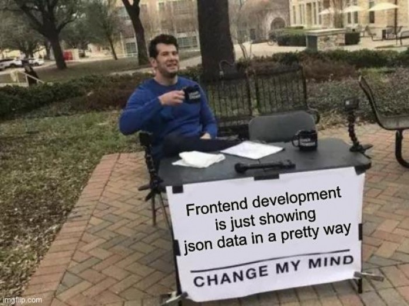

# MVVM 종결(?)

## 클라이언트 프로그램

1. 클라이언트 프로그램은 Data 를 View 에 이쁠게 그려주는 것이다.
2. 그런데 그 Data 라는 것은 3가지 형태가 존재한다.
   1. 서버로부터 받은 원천 데이터 : `Entity`
   2. 비지니스 로직에서 사용하는 근본 데이터 : `Model`
   3. 화면에 보이기 위한 화면 데이터 : `ViewModel`
3. 화면에 보여질 데이터를 Model 로부터 만들고 가지고 있는 것이 `ViewModel` 이다.

## DataBinding

1. 프로그램이 이렇게 구성된다고 볼 때
   - 화면 View
   - 비지니스 로직 Service
2. 가장 중요한 부분은 비지니스 로직 Service 이다.
3. 이 비지니스 로직 Service 에서 취급하는 데이터가 Model 이다.
4. 이 모델은 (물론 생산하는 것도 있겠지만) 어딘가로부터 전달된 것이다.
5. 서버 혹은 DB로부터 전달된 데이터를 구분하기 위해 원천 데이터 Enity 하고 하자.
6. 이것을 가져오는 역할을 하는 것이 Repository 이다.
7. 화면 View 는 Service가 처리한 데이터 Model 을 화면에 그려내는 것이다.
8. 그런데 Model을 그대로 그려낼 수 없다. 화면용 데이터로 변환이 필요하다.
9. 그 화면용 데이터가 View 용 Model 인 ViewModel 이다.

### 의존도를 그려보면

- View -> Service -> Repository
- ViewModel -> Model -> Entity

1. 이렇게 화살표 방향을 일관성 있도록 유지하려면
2. View는 ViewModel을 사용하기만 해야할 뿐,
3. ViewModel 이 View를 알아서는 안된다.
4. 그러다 보니, View 가 ViewModel의 데이터 변경을 스스로 알아챌 필요가 있고
5. 그래서 DataBinding이 필요해 진다.

> 결국 데이터를 용도에 따라 구분해 놓고 그 의존관계를 일관성 있게 유지하려면  
> DataBinding이 등장할 수 밖에 없게 된다.

## 결론

1. MVVM 이 DataBinding 자체를 말하는 것이 아니다.
2. MVVM 에서 VM에 모든 비지니스 로직이 있어야 하는 것이 아니다.
   - 비지니스 로직은 Service 같은 곳에 있어야 하고
   - VM에서는 화면용 데이터를 갖고 있는것,
   - Model 을 View용 Model 로 변경하는 정도의 로직 만 있으면 된다.
3. MVVM의 데이터 의존관계를 일관성있게 유지하기 위해서 VM은 V를 알면 안된다.
4. MVVM 의 DataBinding를 위해서 반드시 RxSwift 같은 것을 사용해야만 하는 것은 아니다.

---

### 기타

1. SwiftUI 를 하다보면 구성 자체가 MVVM으로 되어 있어 어쩔 수 없이 MVVM을 사용하게 된다.
2. ObservableObject 에서는 UI에 그려질 데이터를 제공해야 하니까 VM 이다.
3. 비지니스 로직이 ObservableObject에 있어야 하나? 그럴필요 없다. Service 같은 곳으로 분리해야 하는 것이 맞다.
4. ObservableObject 에서 Service에 어떻게 접근해야 하는가? 그래서 DI가 필요한 것이다.
